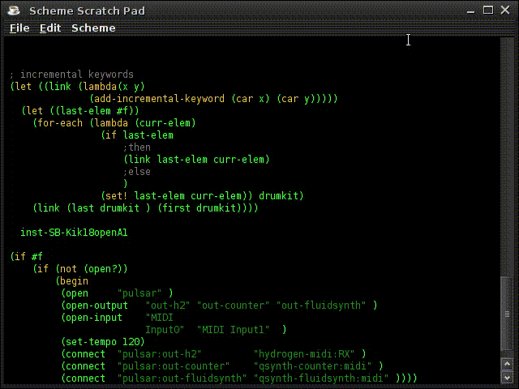

Lamu a Programmable Music Sequencer 
===================================

### Write Scheme and Make Music by Lamu ###



Lamu (stands for LAmbda-MUsic) is a music sequencer which enables users to 
write music as Scheme programs. In this system, musical notes and other 
informations are written as Scheme's association lists. The musical notes can 
be dynamically generated as Scheme's association lists on-the-fly. Users can 
also interact with the dynamically generated music at runtime and affect the 
direction that the music is going.

Lamu is written in Java and Scheme which is powered by Kawa a Java based
Scheme implementation. You can process MIDI data via JACKAudio Connection Kit
a multiplatform audio connection system which is accessed via Java Native
Access.

Lamu runs on most major platforms which can run Java such as Windows, Mac-OSX
and various Linux distributions. 

### Architecture ### 

You may ask, what the heck is this? Well, this is merely a JACKAudio client 
which works with a powerful scripting language Scheme. This could be a 
live-coding environment, or a JACK connection controller which can be executed 
from your shell, or could be anything; it is very simple yet incredibly 
powerful way to play music, in my humble opinion. I have not tried other 
live-coding environment such as SuperCollider, Sonic Pi and others; but I am 
fairly sure this can be a very Linux-way to implement a live-coding 
environment.

![Architecture][architecture]

I started to write this program to get a metronome to practice the guitar.
And then I realized that this program could be a live-coding environment; I 
started to write a Scheme editor to speed up the way write the Scheme code.  
That is [Kawapad][kawapad]

But later I realized that this program can be JACKAudio connection controller.  
Actually, I have been in a difficult time to get along with LADISH and I have 
never had it work right with my favorite synth applications. The connections 
are too fragile and lost too often. Therefore, I have written some mechanisms 
to restore/scrap a set of connections programmatically. That is 
[Pulsar][pulsar].  Not only is [Pulsar][pulsar] actually to restore/scrap 
connections; I'll talk about it later.


### About Me ###

I am a Japanese programmer born in 1973. I was born and raised in Tokyo.  
Therefore, I have never spoken English in daily life. Believe me. And Japanese 
people is one of the most English resistant people which is extremely stubborn.  
I know it and I have to admit it. But in the meantime I cannot help it.
I have tried so many times to educate this stubborn people and I finally gave 
up. They are too stubborn.  The grammar structure and pronunciation system in 
Japanese are very different from rest of the world and it is extremely 
difficult to make Japanese people understand the difference. It maybe because 
the geographical situation is so isolated from others that the history have 
been developed very differently.  I still haven't found the exact reason why 
Japanese is so different from others.

Therefore, you may find my documentation has some difficulty to be 
comprehended; I have to admit it and please excuse my English in advance. The 
following is a list of documentation which I have written so far about this 
program.

But there may be something that makes me different from other Japanese; I was 
living in _super-rural_ area in North-East Thailand for twelve years and I 
luckily did not die; there were many opportunities that I could die but I 
didn't. During the time I learned a dialect of Laotian language and eventually 
I could speak it very fluently. That experience opened me up to the other 
languages like English. And I studied Scheme in the same period.

Anyways, the following is the list.

### Documentation ###

- [Getting Started](getting-started.md)
- [Pulsar](workspace/pulsar/readme.md)
- [Pulsar API Reference](workspace/pulsar/readme-procs-api.md)
- [Pulsar Notation Reference](workspace/pulsar/readme-notes-api.md)
- [Metro](workspace/metro/readme.md)
- [JavaDoc of Metro](workspace/metro/doc/index.html)
- [KawaPad][kawapad]
- [KawaPad API Reference](workspace/kawapad/readme-api.md)


### Feature ###
- Enables you to write pieces of music as Scheme program.
- Built with Kawa a powerful Scheme implementation.
- Works with JACK Audio Connection Kit and is able to connect to any 
  synthesizer applications support JACK.
- Includes Kawapad; Kawapad is an editor to edit Scheme program 
	- Kawapad can prettify S-Expression.
	- Execute a block of code on-the-fly.
	- Kawapad can be extended by Kawa-Scheme.

### System Requirements ###
Any operating systems that can run the following systems:
- Java 8
- JNA Java Native Access
- JACK Audio Connection Kit

Pulsar has been developed and tested in Ubuntu 16.04. A cursory experiment to
run Pulsar in Windows 10 with Windows JACKAudio was succeeded.  It is still unknown
if Pulsar can run in OS X and further experiments are needed.

Pulser uses following libraries :

- JNA-4.5.0
- JNAJACK-1.3.0
- KAWA-3.0
- JTattoo-1.6.11

These are statically linked to the main file `pulsar.jar`; therefore, they are
not necessary to separately be installed.

### How to Install ###

Pulsar requires [Java8](https://www.java.com/en/download/) and [JACKAudio
Connection Kit](http://jackaudio.org/). Please make sure that these are
properly installed on your environment.

After these prerequisites are installed, just download the JAR file from
[pulsar.jar on the MASTER
branch](https://github.com/lisp-scheme-music/pulsar/blob/master/workspace/pulsar/pulsar.jar).

Currently Pulsar have no installer. Though, Pulsar is a simple JAR (Java
Archive) file and no installation process is required. Just locate the file
anywhere convenient for you, preferably in any directory which is on your
//$PATH// list.


### How to Run ###

In your shell command prompt,
```bash
> java -jar /the-path-to-the-file/pulsar.jar
```
is sufficient to make it run. 

In most platforms, you can also execute the application by double-clicking on
the file in your file-browser.

Pulsar has two interfaces : HTTP interface and window interface.
```bash
> java jar pulsar.jar --no-gui 
```
This disables the window interface.


```bash
> java jar pulsar.jar --no-http
```
This disables the HTTP interface.

```bash
> java jar pulsar.jar [filename]
```
Otherwise every argument is taken as filename. Though, only the first argument
is applied; other arguments are silently ignored. Note that when //--no-gui//
is specified, no filename is applied since there is no editor to edit in that
case.

### How to Run (Advanced) ###

It is very interesting that Kawa can invoke every method on the fly; that is
you do not have to specify the startup class when you start the JVM. Add the
path of//pulsar.jar// to your CLASSPATH then execute Kawa's REPL.

```bash
CLASSPATH="$CLASSPATH:/path-to-pulsar-dir/pulsar.jar" kawa
```
Then, execute the following command in Kawa's REPL.
```scheme
(pulsar.Pulsar:main (java.lang.String[]))
```
This also starts Pulsar sequencer. This may give you some possibility to
control of the application more precisely.


### Execute Scheme Commands from Your Editors ###

If you are a VIM user, 
```VIM
:xmap <Return> :!curl -sSd "`cat`" http://localhost:8192/pulsar
```
this VIM command effectively turns your VIM into a Scheme interactive
editor. Select the specific text and hit your enter-key then the text will be
executed in the Pulsar application instance.

Pulsar listens the port 8192 as a HTTP server, and executes any text which
comes via POST request from a client on localhost. It denies all requests from
hosts other than localhost.

Such kind of trick should easily be implemented in Emacs or other editors, too.


**Disclaimer**

Running Pulsar in a public computer which has a network interface with any
global IP assigned or a running production server etc. causes great security
risks. Do not run Pulsar in such situations.


### Basic  ### 


### Command Reference ###


### Architecture of Pulsar Sequencer ###


Pulsar consists three parts of components :

- [KawaPad](./workspace/kawapad/readme.md )
  KawaPad is a simple editor which can be extended by writing Scheme code.
  It has a number of basic editor functions for writing Scheme programs. These
  functions are written by Scheme itself.

- [Metro](./workspace/metro/readme.md )
  Metro is a simple framework to build music sequencer systems. Metro
  encapsulates JACKAudio and offers mechanisms to send measure-beat based music
  data to JACKAudio.
  

- [Pulsar](./workspace/pulsar/readme.md )
  Pulsar is the main component of this application; Pulsar bridges between
  three components Metro, KawaPad and Kawa  in order to implement the
  accessibility to JACKAudio from Scheme.


### Compilation ###

Pulsar is developed by Eclipse and its repository contains entire
Eclipse's workspace directory.

In most case, opening the workspace directory by Eclipse should compile
the projects inside automatically. In case the project dependency could
not be restored properly, reconfigure it.

Currently there are four projects under Pulsar's workspace; each project
depends on following projects :

```memo
- lib
- kawapad
    +>lib
- metro 
    +-> lib
- pulsar 
    +-> lib
    +-> metro
    +-> kawapad
```

#### Compilation by Ant ####
[workspace]/pulsar/build.xml is a ANT build file which was generated by
Eclipse. This build file can build Pulsar-Sequencer.


[kawapad]: https://lambda-music.github.io/lamu/workspace/kawapad/readme.md
[architecture]: https://lambda-music.github.io/lamu/docs/lambda-music-architecture.png

[vim-modeline]: # ( vim: set spell expandtab fo+=aw: )
